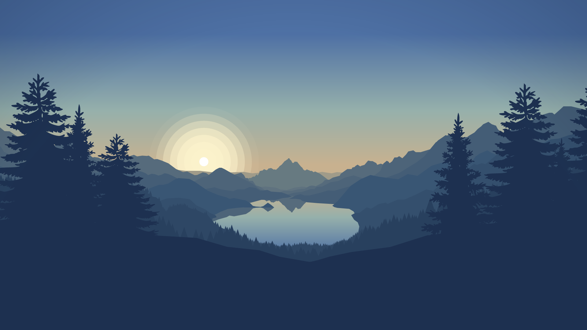

# goldvalley
Wallpaper generator base on time and geographical coordinate

```
$ goldvalley --help
Generate beautiful wallpaper based on geographical position and current time

Usage: goldvalley [OPTIONS] --output <FILE>

Options:
      --lat <LAT>        Your coordinate latitude [default: 48.864716]
      --lon <LON>        Your coordinate longitude [default: 2.349014]
      --alt <ALT>        Your coordinate altitude (in meters) [default: 100]
  -w, --width <WIDTH>    Output size width in pixels [default: 1920]
  -h, --height <HEIGHT>  Output size height in pixels [default: 1080]
  -o, --output <FILE>    Path for the output image
  -h, --help             Print help information
  -V, --version          Print version information
```

```
goldvalley --lat=40.730 --lon=-73.935 --alt=0 -w 1920 -h 1080 -o out.png
```



